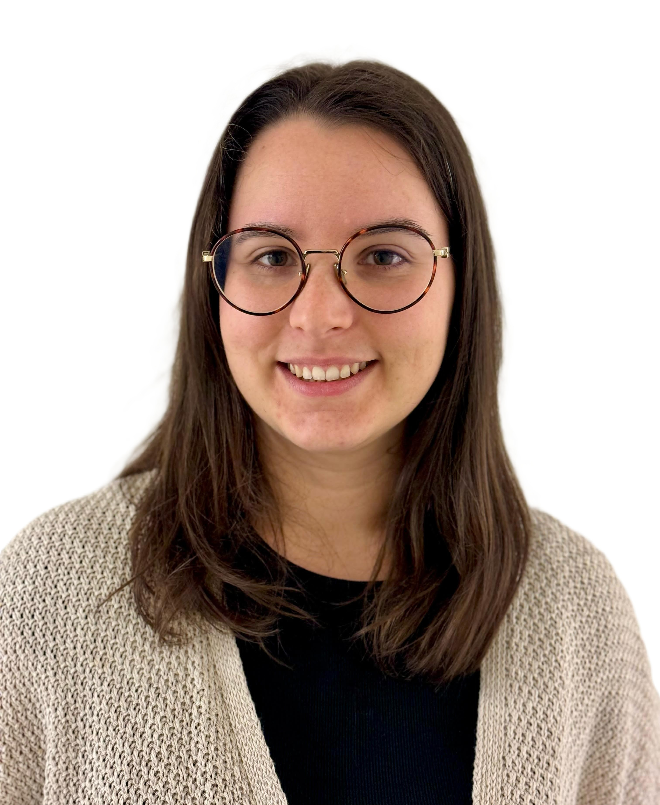
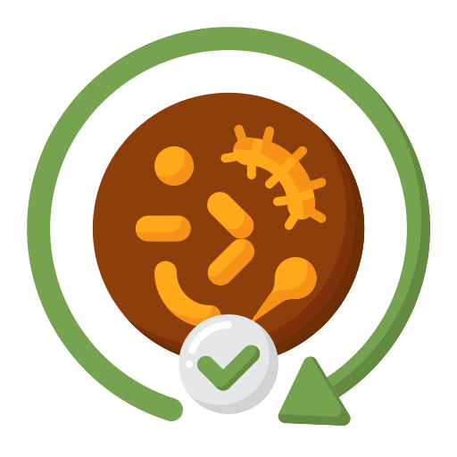
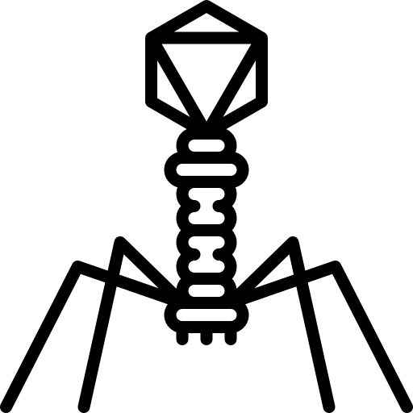
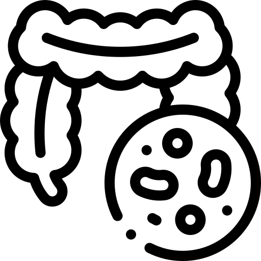
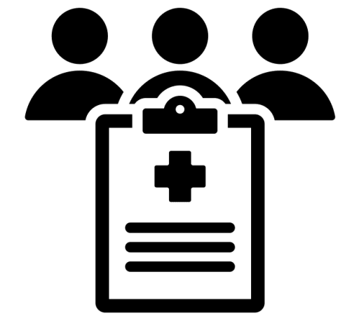
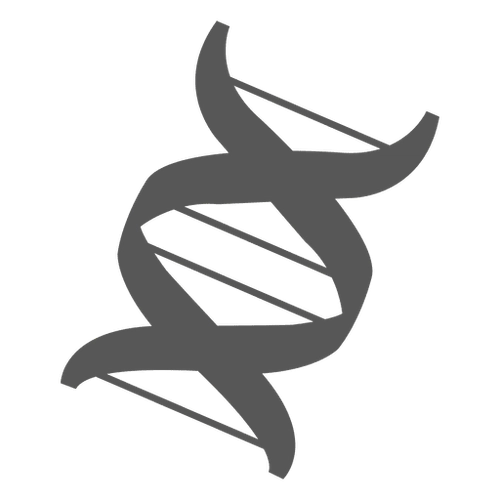
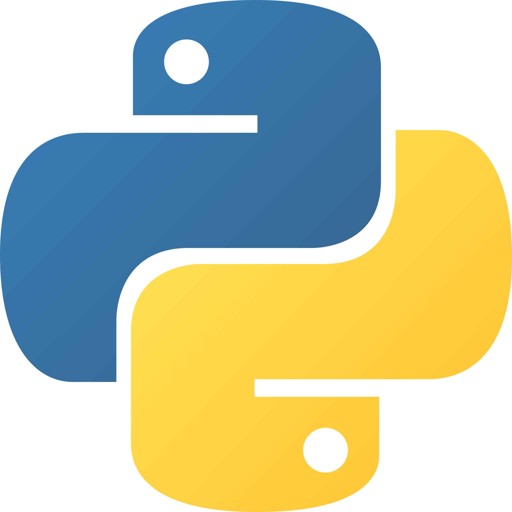
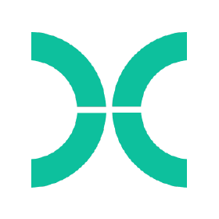

# About me

  

    

Hi, I'm Alessia and I am a bioinformatician exploring how genomics and metagenomics can uncover novel microbial signatures associated with diseases, and how they can support the quality assessment of microbiota-based therapeutics.

  

I recently completed my PhD under the supervision of Prof. Claire Bertelli and Prof. Gilbert Greub at the Institute of Microbiolgy at the Lausanne University Hospital (CHUV), where I'm still working as a research assistant for the <a href="https://www.chuv.ch/en/microbiologie/imu-home/diagnostics/genomics-and-metagenomics" target="_blank" rel="noopener noreferrer">@metagenlab</a>.

    

  

  

    
  

  

###  Interests

  

    
    Probiotics and Microbiota-based therapeutics
  

  

    
    Phage therapy
  

  
  

    
    Microbiota in health and disease
  

  

    
    Clinical trials
  

    
  

    
    Sequencing technologies
  

  

  

### Languages and Tools
 

  

    
  

  

    
  

  
  

    
  

  
  

    
  

    
  

    
  

  
  

  

###  Memberships & Professional Networks

* Member of the National Centre of Competence in Research (NCCRs) - Microbiomes, Switzerland (2020-2025)
* Member of the European Society of Clinical Microbiology and Infectious Diseases (ESCMID)  (2021-2025)
* Member of the Swiss Society for Microbiology (2021-2024)