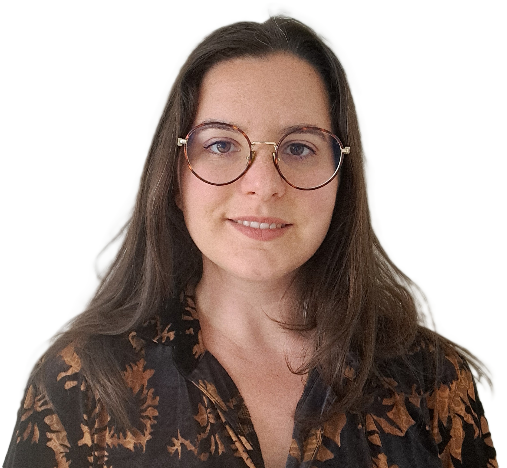
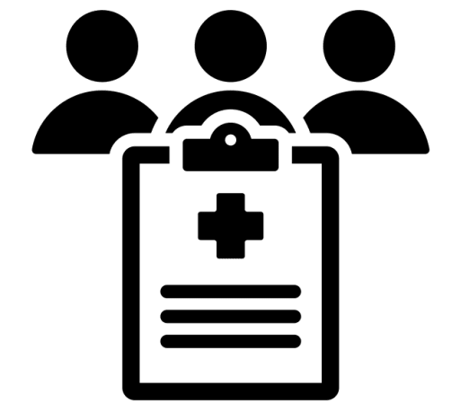
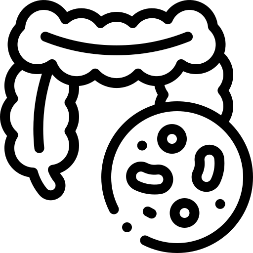
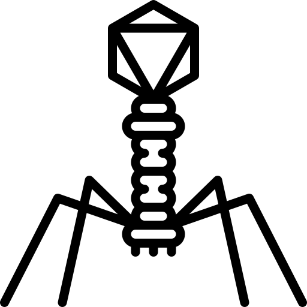
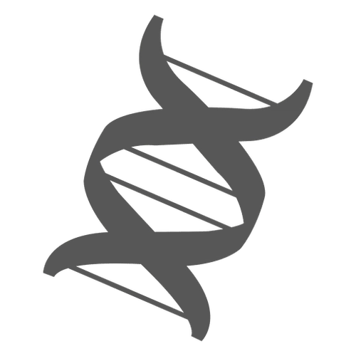
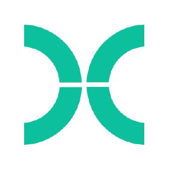

# About me

Hi, I'm Alessia, a clinical research scientist with a background in clinical microbiology and data analysis. My work has focused on using biological and clinical data to investigate disease, treatment response and microbial biomarkers across clinical, translational and preclinical research.

  

I hold a PhD in Clinical Microbiology from the Lausanne University Hospital (CHUV), where I worked across clinical trials, observational studies and preclinical research projects, combining scientific analysis with data interpretation and collaboration with multidisciplinary teams.

  

I am particularly interested in the intersection of clinical research, biological data and healthcare, and in how data and scientific evidence can be used to answer meaningful questions in medicine.

  

###  Interests

  

    
    <strong>Clinical Research & Healthcare Data</strong> 
    Clinical trials · Observational studies · Clinical and biological data
  

  

    
    <strong>Microbiota \& Microbiome</strong> 
    Microbiota in health and disease · Microbiota-based therapeutics
  

 
  

    
    <strong>Clinical Research & Healthcare Data</strong> 
    Clinical trials · Observational studies · Clinical and biological data
  

  

    
    <strong>Phage Therapy</strong> 
    Phage biology · Personalized phage treatment · Therapeutic applications
  

    
  

    
    <strong>Sequencing technologies</strong>
  

  
  

  

### Languages and Tools
 

  

    
  

  

    
  

  
  

    
  

  
  

    
  

    
  

    
  

  
  

  

###  Memberships & Professional Networks

* Member of the National Centre of Competence in Research (NCCRs) - Microbiomes, Switzerland (2020-2025)
* Member of the European Society of Clinical Microbiology and Infectious Diseases (ESCMID)  (2021-2025)
* Member of the Swiss Society for Microbiology (2021-2024)